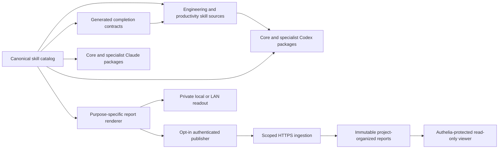

# QuickStark Skills architecture

## System at a glance

QuickStark v3 is a versioned collection of twelve core commands and seven optional specialist commands for Codex and Claude Code. Four former command techniques are internal capabilities. One canonical catalog drives both package projections, lifecycle order, invocation policy, report profiles, and deterministic continuation.

## Sources of truth

| Component | Authoritative source | Responsibility |
| --- | --- | --- |
| Skill identity and behavior | `scripts/qs-skill-catalog.mjs` | Twelve core commands, seven specialists, four internal capabilities, lifecycle order, invocation policy, report profile, and one approved continuation. |
| Engineering skills | `skills/engineering/` | Canonical engineering skill instructions and `agents/openai.yaml` metadata. |
| Productivity skills | `skills/productivity/` | Canonical productivity skill instructions and `agents/openai.yaml` metadata. |
| Claude distribution | `.claude-plugin/plugin.json`, `packages/qs-specialists/` | Isolated core and optional specialist projections. |
| Codex distribution | `codex/plugins/qs-skills/skills/`, `codex/plugins/qs-specialists/skills/` | Generated isolated package snapshots; never edit independently. |
| Readout rendering and publishing | `scripts/qs-skill-readout.mjs` | Report normalization, project identity, bounded task-attributed Codex observations, HTML rendering, viewer, ingestion, publisher, migration, and retention. |
| Report presentation, GitHub evidence, and user appearance | `scripts/qs-skill-report-presentation.mjs` | Approved B presentation, five-second summaries, signed user-bound Workbench preferences, native prompt cards, verified skill-run metrics, user-run commands, exact open-issue totals, and separate sampled-issue sidebars. |
| Privileged Dashboard Settings | `scripts/qs-readout-settings.mjs` | Exact proxy identity, administrator authorization, report-style personal-settings and producer-token sidebar, safe token-table CRUD, cross-user-safe appearance, and one-time token-specific platform installation. |
| Producer credential issuance | `scripts/qs-readout-producer-token.mjs` | Interprocess-locked issuance, atomic display-name updates, independent immediate revocation, and SHA-256-only bearer grants. |
| Skill output contracts | `scripts/sync-skill-output-contracts.mjs` | Generated completion-report and next-step instructions in canonical skill and documentation files. |
| Package projection generation | `scripts/sync-codex-plugin.mjs` | Deterministically synchronizes isolated core and specialist packages, manifests, capabilities, and shared runtime support. |
| Production deployment | `deploy/readouts/compose.yaml` | Independently isolated read-only viewer, authenticated ingestion, and privileged Dashboard Settings services behind the existing reverse proxy. |
| Behavioral verification | `tests/qs-skills.test.mjs` | Observable skill, plugin, reporting, publishing, security, and documentation behavior. |
| Real-browser report verification | `tests/qs-report-presentation.test.mjs` | Chromium-measured 13 px featured observations, 12 px native prompts and code blocks, responsive card alignment, complete wrapped module visual summaries, full-height report rendering, immutable history, and GitHub issue sidebars. |

The upstream `misc`, `personal`, `in-progress`, and `deprecated` directories remain reference material. They are not promoted, routed, or packaged.

## Skill packaging

The catalog records whether a skill must be explicitly requested or may also be selected automatically. Claude uses `disable-model-invocation: true` for explicitly invoked skills. Codex represents the same restriction in `agents/openai.yaml` using `policy.allow_implicit_invocation: false`. The Codex synchronizer removes Claude-only frontmatter while preserving the actual invocation policy.

A public command has one canonical `SKILL.md`, matching agent metadata, lifecycle-ordered index entries, concise generated documentation, one package assignment, and one generated Codex snapshot. Core packages include the four internal capability references; specialist packages do not. Keep the package, lockfile, and all four plugin manifests on the same version.

## Readout lifecycle

1. The invoked skill records only its observed outcome, findings, decisions, outputs, checks, genuinely relevant next steps, optional terminal commands the user actually needs to run, and noteworthy source excerpts.
2. The renderer automatically captures the actual execution hostname and platform.
3. The canonical Git origin resolves to a safe project identity such as `github.com/quickstark/skills`.
4. GitHub repository ownership, the complete open-issue count, and a bounded sample of explicitly open same-repository issues are verified independently; samples never stand in for the total.
5. Verified deployments and run-owned repository-relative file changes are included only when explicitly observed. Local Git branches and commits remain unlinked unless their exact remote publication is independently verified.
6. The catalog selects a purpose-specific B visual profile. Previews cannot claim a skill run, machine, changed file, deployment, test, issue, or release.
7. When the active Codex task contains one exact user-requested skill and an independently observed pre-task provider baseline, the renderer subtracts that baseline from the observed task counters and captures only the actual model, reasoning effort, input and output tokens, and elapsed active skill time. Ambiguous tasks, mixed models, missing baselines, and unrelated thread or cumulative usage remain `Not captured`. No user prompts, responses, tool output, environment variables, or session contents enter the report.
8. A unique, self-contained HTML report stores those genuinely attributed skill measurements; the verified issue total; bounded issue evidence; explicitly recorded user-run commands; and key source excerpts separately in immutable metadata.
9. The full-height Project Workbench reconstructs its report sections and separate issue sidebar only from validated, same-project immutable evidence. Authenticated appearance preferences change the Workbench wrapper and responsive layout, never the existing historical report bytes.
10. Native skill rendering always uses `render --require-hosted`, validates an explicitly configured `QS_READOUT_PRODUCER_TOKEN`, and securely discovers owner-only credentials without following any profile or intermediate-directory symlink. On Linux and Windows the explicit token keeps its existing precedence. On macOS the current `.codex` or `.codex-demo` profile's installed credential or separately named Keychain item takes precedence over a legacy shared desktop token; the explicit token remains the fallback when no profile-specific credential exists. Machine-specific files and the legacy macOS Keychain item remain supported without overriding a selected profile. The renderer automatically infers the actual project from its current working directory, uses a Git origin when available or a safely fingerprinted local workspace otherwise, captures the originating Git branch, complete revision, upstream tracking, and worktree state when actually observable, defaults the harness to `codex`, and submits a versioned structured envelope to `https://reports.quickstark.com/api/v1/readouts`. It returns only the accepted canonical public reports URL without GitHub verification, a private-IP viewer, owner pattern, project list, producer identifier, or additional machine configuration. Missing credentials, unauthorized producers, unsafe endpoints, and rejected delivery fail clearly while preserving a private immutable recovery artifact. Deliberately requested local, LAN, or SSH preview viewers remain private and separate from actual skill reports.
11. The ingestion service authenticates the token, derives the authorized producer identity, accepts any safely identified project under the explicit token-wide server grant, validates originating Git evidence against the same canonical project, includes it in the immutable request digest, independently verifies public GitHub facts when available, renders safe server-owned HTML, and persists an immutable report. Cross-project, malformed, changed, or fabricated Git observations are rejected.
12. The existing read-only viewer exposes approved reports and safe primary visual artifacts through browser authentication; a visual artifact never becomes an invented skill run.
13. Dashboard Settings accepts forwarded user identity only from the specifically configured authentication proxy on its private internal Docker network. Its report-style sidebar separates profile preferences from the producer-token table. Creating a token opens a single modal, selects Linux, macOS, Windows, or authenticated ChatGPT, and reveals the independently revocable credential and exact token-embedded installation command only once. macOS adds an explicit default or demo profile selector; each command can run from an ordinary Terminal without an inherited `CODEX_HOME` and never configures a shared `launchctl` token. Safe row actions show metadata, change a display name, or immediately revoke one producer without exposing a previously issued token. Profile preferences are signed and user-bound for the live Workbench.

Delivery provenance is optional and evidence-based. A local commit is not a published commit; a version in `package.json` is not evidence of a Git tag, a GitHub release, a merged pull request, or a closed issue.

### User-run commands and key code

`commands` is an optional array of actual pending user actions. Each entry contains a concise `title`, the exact `command`, and a `detail` explaining why or when the user should run it. Commands already executed by the skill belong in observed checks or outcomes, not in a user-action section.

`keyCode` is an optional array of meaningful source excerpts. Each entry contains a `title`, exact `code`, a safe syntax `language`, and an optional validated project-relative `path` and `detail`.

The shared presentation module renders both collections as separately titled, responsive, 12 px code blocks after native next prompts. The readout embeds the normalized evidence in immutable metadata. The Workbench reconstructs each section only when its visible content exactly matches that evidence. Previews, missing data, fabricated execution logs, unsafe paths, private keys, tokens, and modified immutable content never create a user instruction.

## GitHub integration and release

Implementation, behavior-first testing, and independent review precede delivery. `/qs-git-merge` then inspects the verified current branch, remote tracking, GitHub pull-request state, and actual merge or rebase before selecting an integration path:

- A reviewed default-branch commit ahead of `origin/main` requires an explicitly approved `git push origin main`; no branch merge is invented.
- A feature branch can require an explicitly approved branch push, pull request, successful required checks, and GitHub pull-request merge.
- An actual merge or rebase conflict is resolved against both original intentions and the project's verified checks.
- `/qs-deploy-release` remains a separate, explicitly approved production or release operation.

Never publish to the read-only `upstream` reference. Record remote publication, pull-request merges, issue closure, and releases only after independently verifying each actual GitHub artifact.

## Production trust boundaries

- The public browser library is protected by Traefik and Authelia; it is read-only.
- Privileged Dashboard Settings is reachable only by the authentication proxy on its dedicated internal network and independently verifies the proxy's exact source IP before trusting user or group headers.
- Only the dedicated `/api/v1/readouts` route accepts authenticated producer submissions.
- Producer credentials are represented in server configuration by SHA-256 digests, not bearer-token plaintext.
- Independent token-generating processes serialize the complete producer-grant transaction with an owner-only, bounded interprocess lock.
- User appearance is signed with an owner-only secret, bound to the authenticated user, and applied only to the dynamic Workbench wrapper.
- An authenticated producer token is the authorization boundary; an explicit token-wide grant accepts all safely identified projects without making ingestion public.
- Rotating or revoking a producer grant takes effect without restarting ingestion.
- The renderer rejects secret-bearing file paths, unsafe URLs, unverified provenance, cross-project records, arbitrary HTML, and invented activity.
- Reports preserve their immutable run identity; identical retries are safe and conflicting retries are rejected.
- Authenticated hosted publication is mandatory for actual promoted skill completions. Deliberately requested local galleries remain separate, and a failed or unauthorized submission never destroys a safely generated private recovery report.

See [readout operations](./readout-operations.md) for actual deployment, producer setup, health checks, and recovery. See [contributing](./contributing.md) for the catalog-first skill change workflow.
