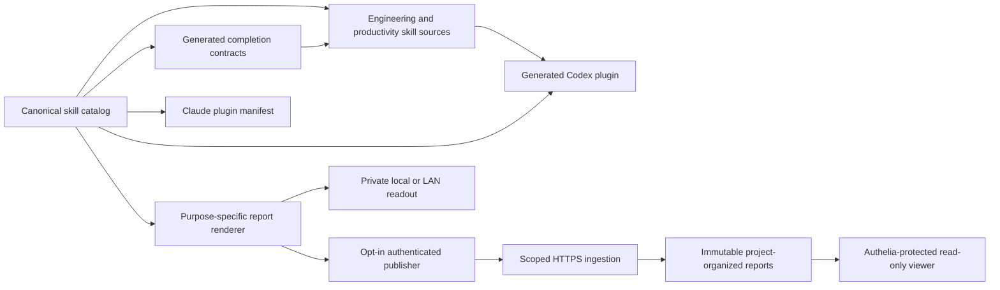

# QuickStark Skills architecture

## System at a glance

QuickStark is a versioned collection of 24 promoted skills for Codex and Claude Code. It adapts 22 upstream skills from Matt Pocock and adds two project-specific workflows: /qs-code-document and /qs-deploy-release. One canonical skill catalog drives both plugin distributions, every generated skill report, and the permitted next-step recommendations.

## Sources of truth

| Component | Authoritative source | Responsibility |
| --- | --- | --- |
| Skill identity and behavior | `scripts/qs-skill-catalog.mjs` | All 24 promoted skills, upstream mapping, bucket, invocation policy, display metadata, report profile, and allowed next skills. |
| Engineering skills | `skills/engineering/` | Canonical engineering skill instructions and `agents/openai.yaml` metadata. |
| Productivity skills | `skills/productivity/` | Canonical productivity skill instructions and `agents/openai.yaml` metadata. |
| Claude distribution | `.claude-plugin/plugin.json` | Explicit list of promoted canonical skill directories. |
| Codex distribution | `codex/plugins/qs-skills/skills/` | Generated, promoted-only snapshot; never edit it independently. |
| Readout rendering and publishing | `scripts/qs-skill-readout.mjs` | Report normalization, project identity, HTML rendering, viewer, ingestion, publisher, migration, and retention. |
| Report presentation and GitHub evidence | `scripts/qs-skill-report-presentation.mjs` | Approved B presentation, five-second summaries, native prompt cards, verified repository ownership, exact open-issue totals, and separate sampled-issue sidebars. |
| Skill output contracts | `scripts/sync-skill-output-contracts.mjs` | Generated completion-report and next-step instructions in canonical skill and documentation files. |
| Codex snapshot generation | `scripts/sync-codex-plugin.mjs` | Synchronizes promoted skill files and the shared catalog, renderer, and report presentation module into the Codex plugin. |
| Production deployment | `deploy/readouts/compose.yaml` | Separate read-only viewer and authenticated ingestion services behind the existing reverse proxy. |
| Behavioral verification | `tests/qs-skills.test.mjs` | Observable skill, plugin, reporting, publishing, security, and documentation behavior. |
| Real-browser report verification | `tests/qs-report-presentation.test.mjs` | Chromium-measured 13 px featured observations, 12 px native prompts, responsive prompt alignment, full-height report rendering, immutable history, and GitHub issue sidebars. |

The upstream `misc`, `personal`, `in-progress`, and `deprecated` directories remain reference material. They are not promoted, routed, or packaged.

## Skill packaging

The catalog records whether a skill must be explicitly requested or may also be selected automatically. Claude uses `disable-model-invocation: true` for explicitly invoked skills. Codex represents the same restriction in `agents/openai.yaml` using `policy.allow_implicit_invocation: false`. The Codex synchronizer removes Claude-only frontmatter while preserving the actual invocation policy.

A promoted skill has one canonical `SKILL.md`, matching agent metadata, an entry in its bucket and root indexes, a page in `docs/engineering/` or `docs/productivity/`, a Claude plugin entry, and a generated Codex snapshot. Keep the package and both plugin manifests on the same version.

## Readout lifecycle

1. The invoked skill records only its observed outcome, findings, decisions, outputs, checks, and genuinely relevant next steps.
2. The renderer automatically captures the actual execution hostname and platform.
3. The canonical Git origin resolves to a safe project identity such as `github.com/quickstark/skills`.
4. GitHub repository ownership, the complete open-issue count, and a bounded sample of explicitly open same-repository issues are verified independently; samples never stand in for the total.
5. Verified deployments and run-owned repository-relative file changes are included only when explicitly observed. Local Git branches and commits remain unlinked unless their exact remote publication is independently verified.
6. The catalog selects a purpose-specific B visual profile. Previews cannot claim a skill run, machine, changed file, deployment, test, issue, or release.
7. A unique, self-contained HTML report stores the verified issue total and bounded issue evidence separately in immutable metadata.
8. The full-height Project Workbench reconstructs a separate issue sidebar only from validated, same-project immutable evidence; existing historical reports are never rewritten.
9. When a producer and project are explicitly authorized, the optional publisher submits a versioned structured envelope to `/api/v1/readouts`.
10. The ingestion service authenticates the producer, verifies both project allowlists, renders safe server-owned HTML, and persists an immutable report.
11. The existing read-only viewer exposes approved reports through browser authentication.

Delivery provenance is optional and evidence-based. A local commit is not a published commit; a version in `package.json` is not evidence of a Git tag, a GitHub release, a merged pull request, or a closed issue.

## Production trust boundaries

- The public browser library is protected by Traefik and Authelia; it is read-only.
- Only the dedicated `/api/v1/readouts` route accepts authenticated producer submissions.
- Producer credentials are represented in server configuration by SHA-256 digests, not bearer-token plaintext.
- A producer-specific project grant and the independent hosted project allowlist must both authorize the project.
- Rotating or revoking a producer grant takes effect without restarting ingestion.
- The renderer rejects secret-bearing file paths, unsafe URLs, unverified provenance, cross-project records, arbitrary HTML, and invented activity.
- Reports preserve their immutable run identity; identical retries are safe and conflicting retries are rejected.
- Publishing is opt-in. A failed or unauthorized remote submission never destroys the local report.

See [readout operations](./readout-operations.md) for actual deployment, producer setup, health checks, and recovery. See [contributing](./contributing.md) for the catalog-first skill change workflow.
