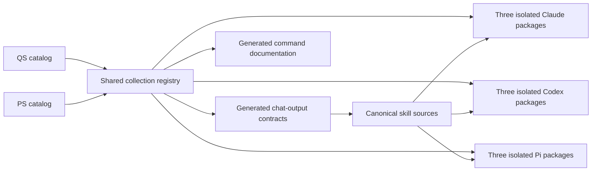

# QuickStark Skills architecture

## System at a glance

QuickStark v3 exposes twelve core QS commands, seven optional QS specialist commands, and thirteen optional explicit-only PS commands for Codex, Claude Code, and Pi. Four former QS commands and sixteen PS techniques remain internal capabilities.

## Sources of truth

| Component | Authoritative source | Responsibility |
| --- | --- | --- |
| QS identity and behavior | `scripts/qs-skill-catalog.mjs` | Core and specialist membership, fixed v2 migration inventory, lifecycle order, invocation policy, effort/report modes, and ranked continuations. |
| PS identity and provenance | `scripts/ps-skill-catalog.mjs` | Thirteen commands, sixteen private capabilities, pinned pstack provenance, fixed dispositions, completion evidence, and continuations. |
| Shared collection identity | `scripts/skill-collection-registry.mjs` | Unique public command identity, package ownership, and exact Codex, Claude, and Pi literals. |
| Canonical QS sources | `skills/engineering/`, `skills/productivity/` | Public QS instructions and matching `agents/openai.yaml` metadata. |
| Canonical PS sources | `skills/pstack/commands/`, `skills/pstack/internal/` | Public PS instructions and private host-neutral capabilities. |
| Shared output policy | `docs/skill-run-contract.md`, `scripts/sync-skill-output-contracts.mjs` | Direct chat presentation, completion states, internal clear-writing pass, and exact next-prompt format. |
| Documentation generator | `scripts/sync-v3-docs.mjs` | Concise command pages generated from registered metadata. |
| Package projector | `scripts/sync-codex-plugin.mjs` | Deterministic Claude, Codex, and Pi packages, manifests, capabilities, notices, and shared catalog metadata. |
| Behavioral verification | `tests/` | Public surface, routing, safety, direct-chat contracts, clear writing, and projection integrity. |

Reference material under `skills/misc/`, `skills/personal/`, `skills/in-progress/`, and `skills/deprecated/` is never promoted or packaged.

## Package boundaries

Each public command belongs to exactly one package:

- `qs-skills`: twelve lifecycle-ordered core commands and four private QS capabilities.
- `qs-specialists`: seven optional specialist commands.
- `ps-skills`: thirteen explicit-only commands, sixteen private capabilities, and the Lauren Tan notice.

Packages never import another package's skill bodies. Claude and Pi use canonical `disable-model-invocation: true` frontmatter for explicit commands; Codex projects the same restriction through `agents/openai.yaml`. Generated package trees are snapshots and are never edited independently.

Keep `package.json`, `package-lock.json`, all three Claude manifests, all three Codex manifests, and all three Pi manifests on the same version.

## Run lifecycle

1. Resolve exactly one public root command from explicit user intent or permitted model invocation.
2. Normalize `effort=quick|standard|deep` and `report=brief|full` independently.
3. Perform only the root's authorized work. Internal capabilities remain inside that run.
4. Determine one completion state: `complete`, `continuation-required`, `input-required`, or `failed`.
5. Select the catalog-approved continuation set. Every non-release result has one preferred prompt and two alternatives; `/qs-deploy-release` is terminal.
6. Apply the internal clear-writing pass after facts, inferences, and uncertainties are separated.
7. Present the result directly in chat with status, outcome, decision-grade evidence, noteworthy failures, material outputs, and the ranked prompts.

The result stays in the current conversation; the run creates no secondary result artifact or external URL.

## Clear-writing boundary

The clear-writing pass is shared policy, not a public command and not a cross-package skill-body import. Every generated completion contract contains the self-contained rule: lead with the outcome, use concrete nouns and verbs, preserve necessary qualifications and technical terms, and remove repetition.

The PS catalog retains `plain-writing` as one of its fixed sixteen internal capabilities because it is the disposition of upstream `skill:unslop`. QS commands receive the same final synthesis through the shared output contract without changing the fixed PS inventory.

## GitHub integration and release

Implementation, appropriate tests, and independent review precede delivery. `/qs-git-merge` inspects the actual branch, remote tracking, pull request, checks, and mergeability before selecting an integration operation. `/qs-deploy-release` remains a separate explicitly approved release or deployment operation.

A local commit is not a published commit. A version in a manifest is not evidence of a tag, release, merged pull request, or deployed service. Verify each external artifact independently, never push personalized changes to the read-only `upstream` remote, and preserve Matt Pocock's and Lauren Tan's MIT notices.

See [contributing](./contributing.md) for the catalog-first change workflow and [the shared run contract](./skill-run-contract.md) for presentation details.
